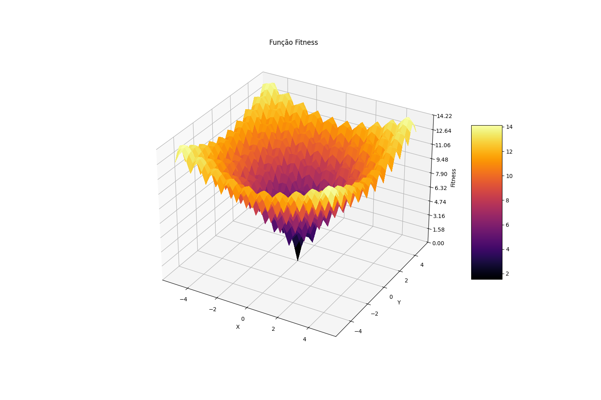
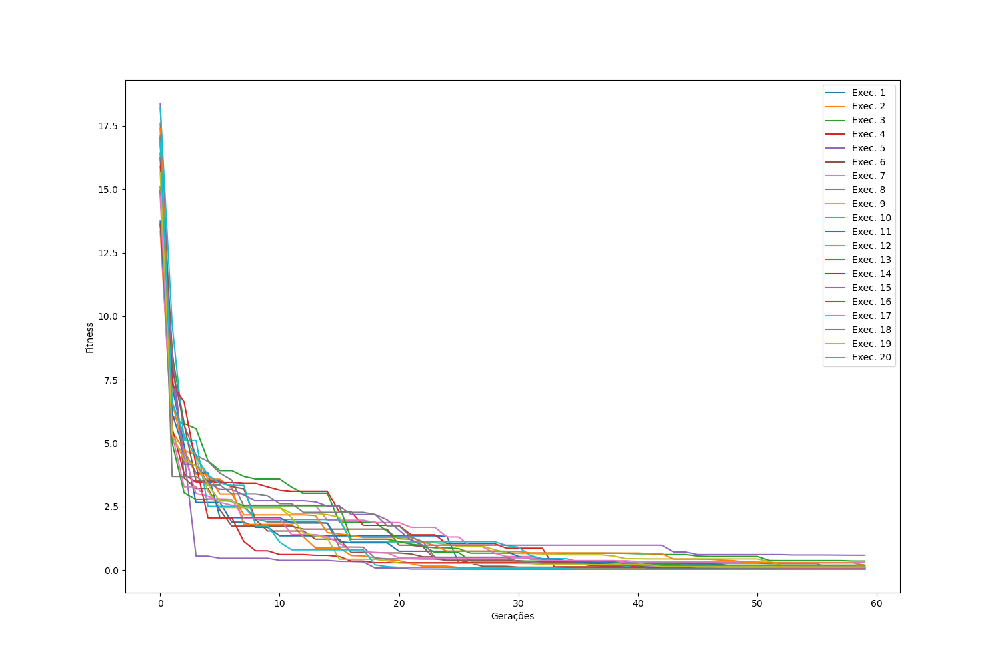
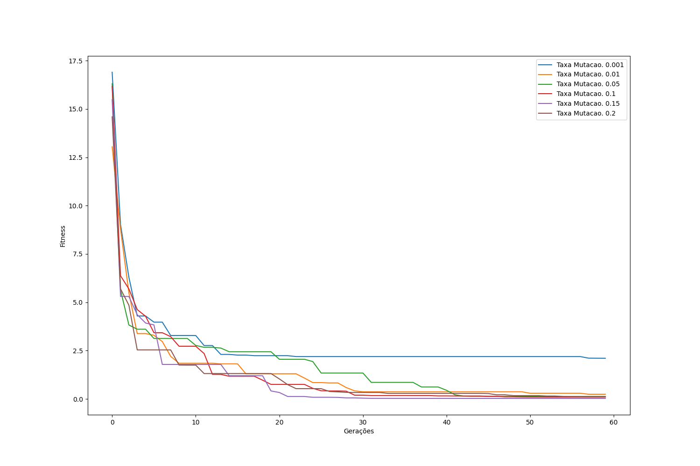
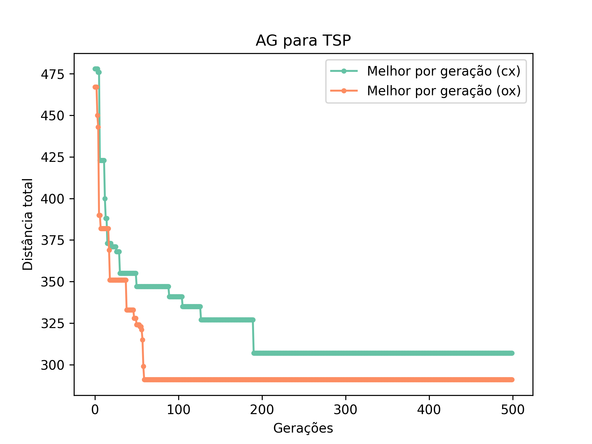
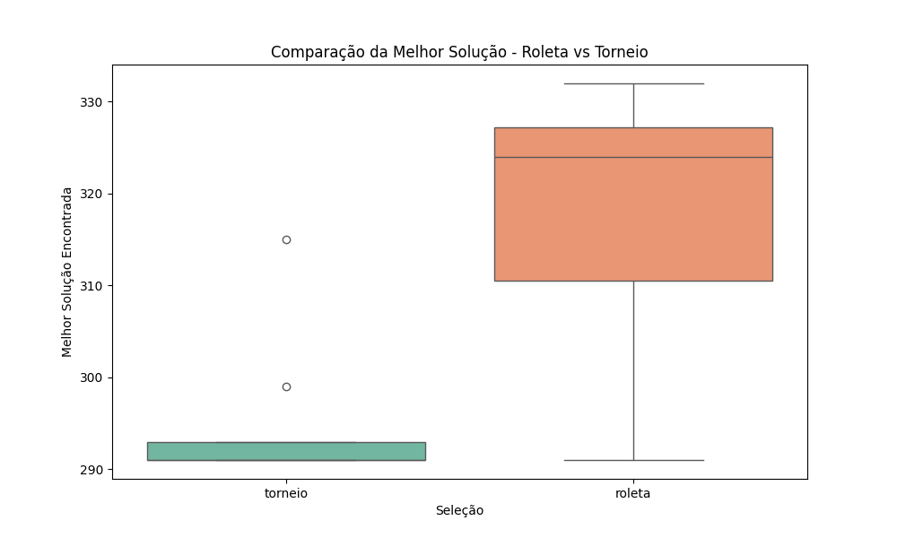
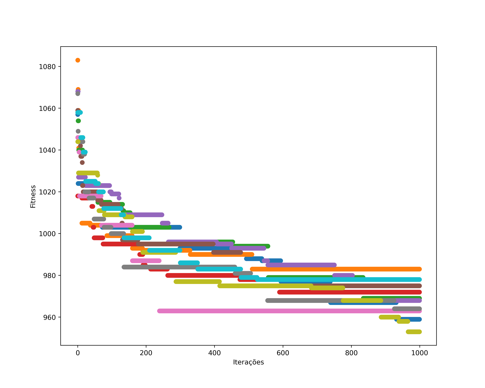
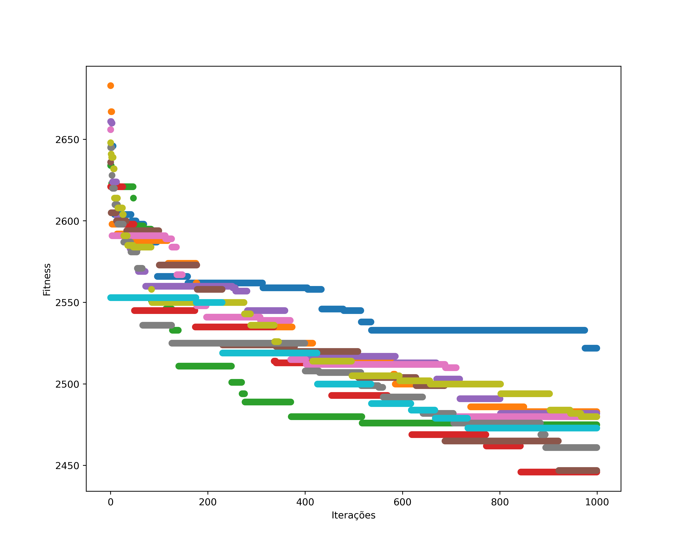

# Bio-inspired computing for optimization

The following optimization algorithms were implemented from scratch (with NumPy). 

1. Genetic Algorithm (binary, continuous and combinatorial)
2. Particle Swarm Optimization Algorithm 
3. Ant Colony System
4. Clonal Selection 
5. Flower Pollination Algorithm (my favourite)

## Genetic Algorithm 
### Ackley
The n-dimensional Ackley function is defined by the following equation: 

$$ f(\mathbf{x}) = -20 e^{-0.2 \sqrt{\frac{1}{n} \sum \mathbf{x}_i ^2}} -e^{\frac{1}{n}\sum cos(2 \pi \mathbf{x}_i)} +20 +e $$

#### Results
Using parameter optimization, the following results were obtained: 

  
  

### Travelling Salesman Problem
Classic combinatorial optimization problem that aims to find the shortest possible route that visits a set of cities exactly once and returns to the starting point. Given a permutation $\pi$ of $n$ cities, the total distance is defined by:

$$f(\pi)=\sum_{i=1}^{n-1} \rho(\pi(i), \pi(i+1))+\rho(\pi(n), \pi(1))$$

where  $\rho(a, b)$ represents the distance between cities $a$ and $b$. For testing (lau_15.txt instance), the global minimun is known as $f(\pi_0) = 291$. 

#### Results

  
  

## Flower Pollination Algorithm - FSSP
Proposed by Yang (2012), the FPA is simple and effective. It was implemented as a part of my final avaliation. In this project, we revisited the original continuous version and extended it to tackle the Flow Shop Scheduling Problem (FSSP), which demands a combinatorial representation.

Key adaptations include:
- Modified global and local pollination operators to maintain feasibility in the FSSP context.
- Discretization of the Lévy distribution to preserve global permutation-based solutions.
- Integration of ordered crossover (OX) as a local pollination strategy.  
- Control of diversity through a tunable cut-rate parameter ($\tau$), determining how much of a solution’s structure is preserved.

Originally, FPA global optimization is the deffined by the Equation: 

$$\mathbf{x}^{t+1}_i = \mathbf{x}^{t}_i + L(\mathbf{x}^{t}_i - g_*)$$

where $g_*$ is the global minimum and $L$ is a Levy-distributed parameter. 

$$L \sim \frac{\lambda \Gamma(\lambda) sin(\pi \lambda/2)}{\pi} \frac{1}{s^{1+\lambda}}$$

Locally, the pollination follows the Equation: 

$$\mathbf{x}_i^{t+1} = \mathbf{x}_i^{t} + \epsilon (\mathbf{x}_j^t - \mathbf{x_k ^t})$$
where $\epsilon$ follows a uniform distribution. 

### Modifications: 
To preserve an integer representation of the FSSP, such as
$$\mathbf{x}_i = \begin{bmatrix}
        a_1 & a_2 & \dots & a_n
    \end{bmatrix}, \  a_i \in \mathbb{Z}^+$$

we modified the continuous Lévy-distribution to a discrete representation. Then, 
$$\mathbf{x}^{t+1}_i = \mathbf{x}^{t}_i + L_d(\mathbf{x}^{t}_i - g_*)$$

Locally, we introduced the OX operator to maintain spatial-related optimization. For $i \neq j \neq k$
$$\mathbf{x}_i, \ \mathbf{x}_j = OX(\mathbf{x}_i, \ \mathbf{x}_k)$$

where $OX: \mathbf{x} \times \mathbf{x}_n \mapsto \mathbf{x}_n$ is the GA operator. 

#### Results 
The global minimum is not know, but previous approaches have obtained $f_1(*) \approx 900$ and $f_2(*) \approx 22 000$. 

  
  

| Group | Minimum 1        | Execution Time (s)  |    |Group  | Minimum 2        | Execution Time (s) |
|-------|------------------|-----------         |----|-------|------------------|-----------|
| 1     | 914              | 35                 |    | 1     | 2309             | 231       |
| 2     | 903              | 4.44               |    | 2     | 2310             | 45        |
| 3     | 919              | 55                 |    | 3     | 2297             | 1.32      |
| 4     | 933              | 2.6                |    | 4     | 2366             | 163       |
| FPA   | 929              | 14.88              |    | FPA   | 2410             | 27.63     |

